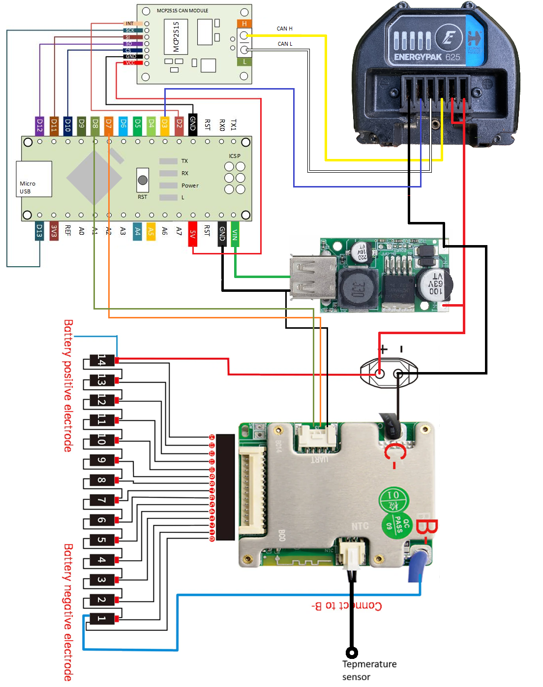

# EnergyHack_JbdBms

Project designed to simulate the original Giant EnergyPak battery used in Giant eBikes.
The project reads data from the Jiabida BMS via UART and simulates responses of the original Giant battery.
MCP2515 sends these data to the e-bike through the CAN Bus.
It consumes approximately 3.5 mA after removing the pwr LEDs, with most power being used by the DC/DC converter.

## Project Goals

- Simulate the behavior of the original Giant EnergyPak battery.  
- Test BMS communication with the e-bike via CAN Bus.  
- Facilitate debugging and development of e-bike software.

## Technologies and Hardware

The project uses the following components:  

- Arduino – controls the battery simulation.  
- Jiabida BMS – real BMS module, communicating with Arduino via UART.  
- MCP2515 – CAN controller that enables Arduino to communicate with the e-bike via CAN Bus.  
- Language: C++ (Arduino IDE).  

## Installation

1. Clone the repository:  
   ```bash
   git clone https://github.com/kezcelm/EnergyHack_JbdBms.git

2. Open the project in Arduino IDE:
Main file: EnergyHack_JbdBms.ino
Ensure the JbdBms and mcp2515 libraries are located in the libraries folder.

3. Connect Arduino, Jiabida BMS, and MCP2515 according to the wiring diagram
 